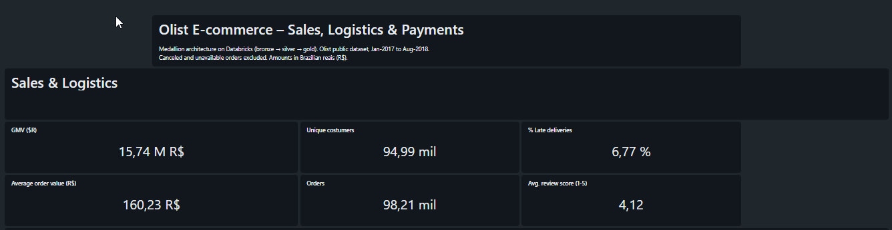
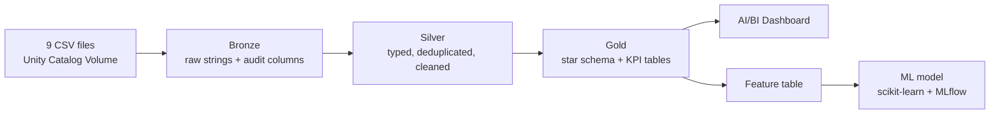
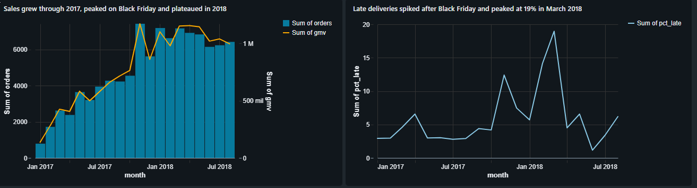
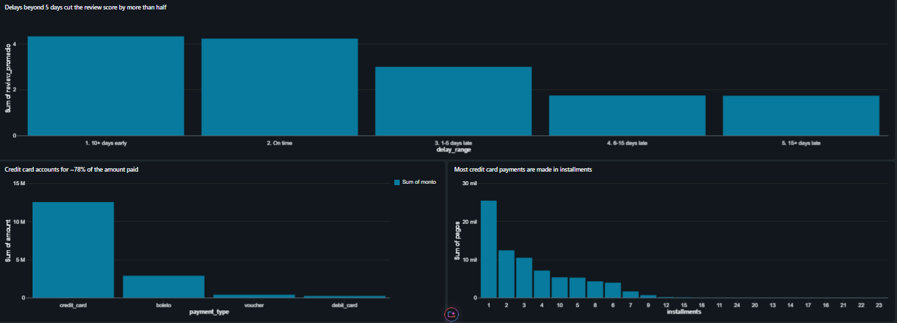
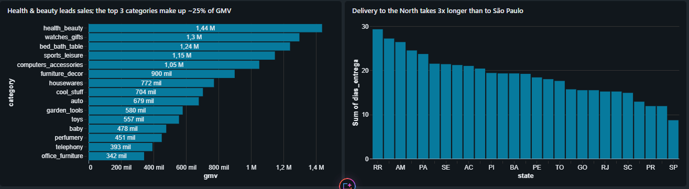
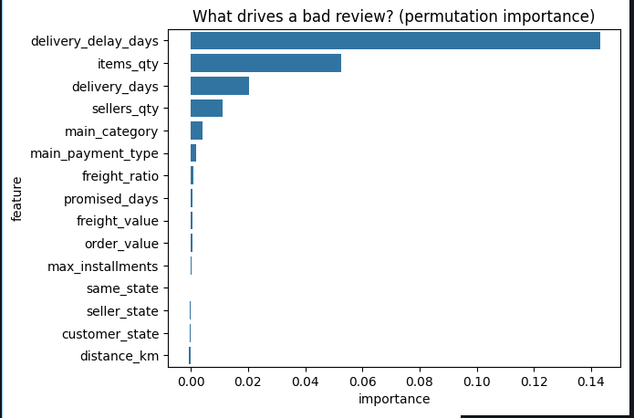
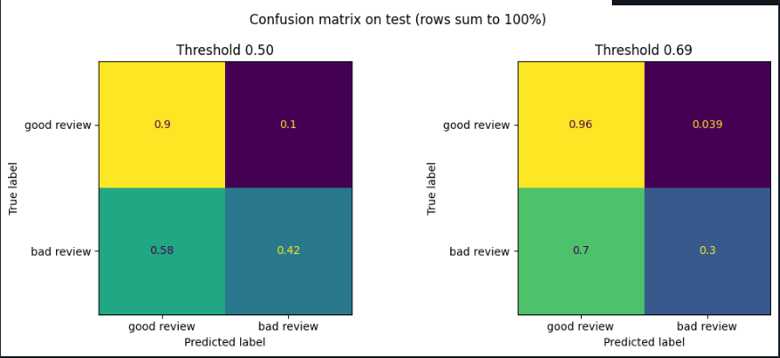

# Olist E-commerce – Medallion Lakehouse on Databricks

End-to-end data project on **Databricks Free Edition**: raw CSVs are ingested into a **bronze → silver → gold** medallion architecture, modeled as a **star schema**, reconciled to the cent, visualized in an **AI/BI dashboard**, and used to train a **machine learning model** that predicts bad customer reviews at delivery time.

**Dataset:** [Brazilian E-Commerce Public Dataset by Olist](https://www.kaggle.com/datasets/olistbr/brazilian-ecommerce) (Kaggle) — ~100K real orders from 2016–2018 across 9 related tables. Amounts are in Brazilian reais (R$).



---

## Architecture



| Layer | Tables | What happens |
|---|---|---|
| **Bronze** | 9 | CSVs loaded as-is (all strings), plus `_ingest_ts` and `_source_file` for traceability |
| **Silver** | 8 | Type casting, deduplication with `QUALIFY ROW_NUMBER()`, text normalization, category translation, geolocation collapsed from ~1M rows to one row per zip prefix |
| **Gold** | 4 dimensions, 3 facts, 2 KPI tables | Star schema with informational PK/FK constraints, ready for BI and ML |

### Gold data model

| Table | Grain (one row per…) | Purpose |
|---|---|---|
| `dim_customer` | real customer (`customer_unique_id`) | Location, first purchase, repeat customer flag |
| `dim_seller` | seller | Location |
| `dim_product` | product | English category, dimensions, volume |
| `dim_date` | day | Calendar attributes |
| `fact_sales` | order item | Revenue by product, category and seller |
| `fact_orders` | order | Order value, delivery time, delay, review score |
| `fact_payments` | payment | Payment method and installments |
| `kpi_ventas_mensuales`, `kpi_sellers` | month / seller | Pre-aggregated tables for the dashboard |

**Why three fact tables?** Reviews and delivery delays belong to the *order*, not to the item. Putting them in an item-level table would count a 5-item order's review five times and bias every average.

---

## Key technical decisions

- **`customer_id` vs `customer_unique_id`:** in Olist, `customer_id` changes with every order. Grouping by it would count one customer who ordered three times as three customers. All customer metrics use `customer_unique_id`.
- **Zip code padding:** zip prefixes lose their leading zeros in the CSVs. `lpad(zip, 5, '0')` restores them; without it, the geolocation join fails silently. Result: **99.72%** of customers matched to coordinates.
- **Everything is idempotent:** `CREATE OR REPLACE` and `overwrite` mean the whole pipeline can be re-run safely.
- **One review per order:** some orders had several reviews; silver keeps the most recent one to avoid duplicating rows downstream.

---

## Data quality: reconciled to the cent

GMV was calculated from two independent fact tables and compared against payments:

| Concept | Amount (R$) |
|---|---|
| GMV (items + freight) — `fact_sales` and `fact_orders` match exactly | 15,843,553.24 |
| + Payments on orders with no items (canceled / unavailable) | 162,591.95 |
| + Net overpayment on orders with items (installment interest) | 2,870.39 |
| − Items on orders with no recorded payment | 143.46 |
| **= Total paid (`fact_payments`)** | **16,008,872.12** |

- 98% of the gap comes from **775 orders with no items**: 603 `unavailable`, 164 `canceled`, and **8 anomalies** (5 `created`, 2 `invoiced`, 1 `shipped` with no products).
- The 264 orders that paid more than their value average **6.3 installments vs 2.9** for the rest, which supports the installment-interest explanation.

---

## Business findings (dashboard)

| KPI | Value |
|---|---|
| GMV | R$ 15.74M |
| Orders | 98.2K |
| Unique customers | 95.0K |
| Average order value | R$ 160.23 |
| Late deliveries | 6.77% |
| Average review score | 4.12 / 5 |

*Canceled and unavailable orders excluded.*

1. **Sales grew through 2017, peaked on Black Friday (Nov 2017) and plateaued at ~R$1.0–1.1M/month in 2018.**
2. **Logistics did not keep up:** late deliveries went from ~3–5% in 2017 to ~12% in Nov 2017 and ~19% in Mar 2018.
3. **Delays destroy satisfaction:** on-time orders average ~4.2 stars; beyond 5 days late, the score falls below 2.
4. **Credit card accounts for ~78% of the amount paid**, followed by boleto.
5. **Delivery to the North takes ~3x longer:** ~9 days to São Paulo vs ~27–29 days to RR, AP and AM.
6. **Almost no one buys twice:** 98.2K orders from 95.0K unique customers.

<details>
<summary><b>More dashboard screenshots</b></summary>





</details>

---

## Machine learning: predicting bad reviews at delivery time

**Business question:** when an order is delivered, can we flag which ones will receive a 1–2 star review, so customer service can act first?

**Design choices**
- **No data leakage:** only information available at delivery time is used — nothing derived from the review itself.
- **Temporal split:** trained on orders before May 2018, tested on May 2018 onward, to simulate predicting the future.
- **Class imbalance handled** with `class_weight="balanced"` and evaluated with PR-AUC instead of accuracy.
- **New feature:** seller–customer distance (km), computed with the haversine formula.
- **Experiment tracking** with MLflow autologging.

**Results (test set)**

| Model | ROC-AUC | PR-AUC | Recall | Precision |
|---|---|---|---|---|
| Logistic regression (baseline) | 0.692 | 0.259 | 0.377 | 0.277 |
| **HistGradientBoosting** | **0.701** | **0.328** | **0.421** | **0.310** |

The gradient boosting model wins on every metric. Its PR-AUC is about 2.5x the baseline rate of bad reviews.



**What drives a bad review?**
- **Delivery delay is by far the strongest driver:** shuffling it drops PR-AUC by ~0.14.
- **Order complexity matters:** orders with more items or multiple sellers are riskier — possibly because they ship in separate packages and arrive incomplete (hypothesis).
- **Distance adds no information once delivery time is known.** Orders shipped over 876 km do have more bad reviews (~15% vs ~10% under 116 km), but the effect runs *through* longer, less reliable deliveries — a clear case of correlation ≠ causation.
- **Payment method and installments do not predict satisfaction.**



The model correctly classifies 90% of good reviews and detects 42% of bad ones. It is best at flagging **logistics-driven** bad reviews — exactly the ones the business can prevent. Remaining misses likely come from causes not in the data (product quality, wrong item).

---

## Notebooks

| Notebook | What it does |
|---|---|
| [02_Silver.ipynb](02_Silver.ipynb) | Cleaning, typing, deduplication and validation |
| [03_gold.ipynb](03_gold.ipynb) | Star schema, KPI tables, constraints and reconciliation |
| [04_ML_bad_reviews.ipynb](04_ML_bad_reviews.ipynb) | Feature table, training, evaluation and interpretation |

**Bronze ingestion** (run once before `02_Silver`): loads the 9 CSVs from the Volume as strings and adds audit columns.

```python
from pyspark.sql import functions as F

base = "/Volumes/workspace/landing/olist_raw"
files = {
    "customers": "olist_customers_dataset.csv", "orders": "olist_orders_dataset.csv",
    "order_items": "olist_order_items_dataset.csv", "order_payments": "olist_order_payments_dataset.csv",
    "order_reviews": "olist_order_reviews_dataset.csv", "products": "olist_products_dataset.csv",
    "sellers": "olist_sellers_dataset.csv", "geolocation": "olist_geolocation_dataset.csv",
    "category_translation": "product_category_name_translation.csv",
}

for table, file in files.items():
    (spark.read.option("header", True).option("multiLine", True).option("escape", '"')
        .csv(f"{base}/{file}")
        .withColumn("_ingest_ts", F.current_timestamp())
        .withColumn("_source_file", F.col("_metadata.file_path"))
        .write.mode("overwrite").saveAsTable(f"workspace.bronze.{table}"))
```

## How to reproduce

1. Create a free account on [Databricks Free Edition](https://www.databricks.com/learn/free-edition).
2. Download the [Olist dataset](https://www.kaggle.com/datasets/olistbr/brazilian-ecommerce) and upload the 9 CSVs to a Unity Catalog Volume (`workspace.landing.olist_raw`).
3. Run the bronze ingestion snippet above, then import the notebooks and run them in order (02 → 04). Notebook 04 needs `seaborn`, `scikit-learn` and `mlflow` in the notebook environment.
4. Build the AI/BI dashboard on top of the gold tables (see screenshots above).

## Tech stack

Databricks Free Edition (serverless) · Unity Catalog · Delta Lake · PySpark · Spark SQL · AI/BI Dashboards · pandas · scikit-learn · MLflow · Matplotlib · Seaborn

---

**Author:** Nahuel — Data Engineer · [LinkedIn](https://www.linkedin.com/in/nahuel-mart%C3%ADnez-77161827b/)
