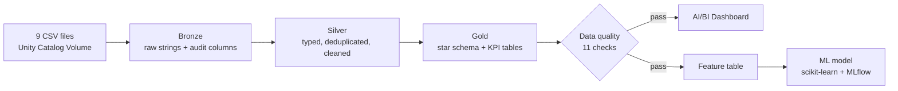

# Olist E-commerce – Medallion Lakehouse on Databricks

End-to-end data project on **Databricks Free Edition**: raw CSVs are ingested into a **bronze → silver → gold** medallion architecture, modeled as a **star schema**, reconciled to the cent, gated by **automated data quality checks**, orchestrated with a **Lakeflow Job**, visualized in an **AI/BI dashboard**, and used to train a **machine learning model** that predicts bad customer reviews at delivery time.

**Dataset:** [Brazilian E-Commerce Public Dataset by Olist](https://www.kaggle.com/datasets/olistbr/brazilian-ecommerce) (Kaggle) — ~100K real orders from 2016–2018 across 9 related tables. Amounts are in Brazilian reais (R$).


---

## Architecture



| Layer | Tables | What happens |
|---|---|---|
| **Bronze** | 9 | CSVs loaded as-is (all strings), plus `_ingest_ts` and `_source_file` for traceability. The notebook checks that all 9 files exist and that no table is empty |
| **Silver** | 8 | Type casting, deduplication with `QUALIFY ROW_NUMBER()`, text normalization, category translation, geolocation collapsed from ~1M rows to one row per zip prefix |
| **Gold** | 4 dimensions, 3 facts, 2 KPI tables | Star schema with informational PK/FK constraints, ready for BI and ML |

### Gold data model

| Table | Grain (one row per…) | Purpose |
|---|---|---|
| `dim_customer` | real customer (`customer_unique_id`) | Location, first purchase, repeat customer flag |
| `dim_seller` | seller | Location |
| `dim_product` | product | English category, dimensions, volume |
| `dim_date` | day | Calendar attributes |
| `fact_sales` | order item | Revenue by product, category and seller |
| `fact_orders` | order | Order value, delivery time, delay, review score |
| `fact_payments` | payment | Payment method and installments |
| `kpi_ventas_mensuales`, `kpi_sellers` | month / seller | Pre-aggregated tables for the dashboard |

**Why three fact tables?** Reviews and delivery delays belong to the *order*, not to the item. Putting them in an item-level table would count a 5-item order's review five times and bias every average.

---

## Key technical decisions

- **`customer_id` vs `customer_unique_id`:** in Olist, `customer_id` changes with every order. Grouping by it would count one customer who ordered three times as three customers. All customer metrics use `customer_unique_id`.
- **Zip code padding:** zip prefixes lose their leading zeros in the CSVs. `lpad(zip, 5, '0')` restores them; without it, the geolocation join fails silently. Result: **99.72%** of customers matched to coordinates.
- **Everything is idempotent:** `CREATE OR REPLACE` and `overwrite` mean the whole pipeline can be re-run safely. Foreign keys are dropped before the gold tables are rebuilt and declared again at the end.
- **One review per order:** some orders had several reviews; silver keeps the most recent one to avoid duplicating rows downstream.

---

## Orchestration and data quality

The pipeline runs as a **Lakeflow Job** (`olist_medallion_pipeline`) with one task per notebook:

```
01_bronze → 02_Silver → 03_gold → 05_quality_checks ─┬→ 04_ML_bad_reviews
                                                     └→ dashboard refresh
```

`05_quality_checks` acts as a **quality gate**: it runs 11 checks, appends every result to `gold.dq_results` to track quality over time, and fails **after** running all of them if any check did not pass. When that happens, the Job stops and the dashboard and the model are never refreshed with bad data.

| Type | Check |
|---|---|
| Volume | `silver.orders` is not empty |
| Uniqueness | `order_id` is unique; one review per order |
| Referential integrity | no order items without an order, a product or a seller |
| Validity | review scores between 1 and 5; no negative prices |
| Completeness | at least 99% of customers have coordinates |
| Consistency | GMV matches between `fact_sales` and `fact_orders` |
| Reconciliation | the GMV → payments bridge (below) closes to the cent |


---

## Reconciliation: GMV to payments, to the cent

GMV was calculated from two independent fact tables and compared against payments:

| Concept | Amount (R$) |
|---|---|
| GMV (items + freight) — `fact_sales` and `fact_orders` match exactly | 15,843,553.24 |
| + Payments on orders with no items (canceled / unavailable) | 162,591.95 |
| + Net overpayment on orders with items (installment interest) | 2,870.39 |
| − Items on orders with no recorded payment | 143.46 |
| **= Total paid (`fact_payments`)** | **16,008,872.12** |

- 98% of the gap comes from **775 orders with no items**: 603 `unavailable`, 164 `canceled`, and **8 anomalies** (5 `created`, 2 `invoiced`, 1 `shipped` with no products).
- The 264 orders that paid more than their value average **6.3 installments vs 2.9** for the rest, which supports the installment-interest explanation.
- This bridge is re-checked automatically on every run by `05_quality_checks`.

---

## Business findings (dashboard)

| KPI | Value |
|---|---|
| GMV | R$ 15.74M |
| Orders | 98.2K |
| Unique customers | 95.0K |
| Average order value | R$ 160.23 |
| Late deliveries | 6.77% |
| Average review score | 4.12 / 5 |

*Canceled and unavailable orders excluded.*

1. **Sales grew through 2017, peaked on Black Friday (Nov 2017) and plateaued at ~R$1.0–1.1M/month in 2018.**
2. **Logistics did not keep up:** late deliveries went from ~3–5% in 2017 to ~12% in Nov 2017 and ~19% in Mar 2018.
3. **Delays destroy satisfaction:** on-time orders average ~4.2 stars; beyond 5 days late, the score falls below 2.
4. **Credit card accounts for ~78% of the amount paid**, followed by boleto.
5. **Delivery to the North takes ~3x longer:** ~9 days to São Paulo vs ~27–29 days to RR, AP and AM.
6. **Almost no one buys twice:** 98.2K orders from 95.0K unique customers.

<details>
<summary><b>More dashboard screenshots</b></summary>


</details>

---

## Machine learning: predicting bad reviews at delivery time

**Business question:** when an order is delivered, can we flag which ones will receive a 1–2 star review, so customer service can act first?

**Design choices**
- **No data leakage:** only information available at delivery time is used — nothing derived from the review itself.
- **Temporal split:** trained on orders before May 2018, tested on May 2018 onward, to simulate predicting the future.
- **Test set used only to measure:** the final model and the decision threshold are chosen on a validation split (the most recent 20% of train), never on test.
- **Class imbalance handled** with `class_weight="balanced"` and evaluated with PR-AUC instead of accuracy.
- **New feature:** seller–customer distance (km), computed with the haversine formula.
- **Experiment tracking** with MLflow autologging, in a fixed experiment path so runs survive notebook re-imports and Job runs.

**Results (test set, threshold 0.50)**

| Model | ROC-AUC | PR-AUC | Recall | Precision |
|---|---|---|---|---|
| Logistic regression (baseline) | 0.692 | 0.259 | 0.378 | 0.278 |
| **HistGradientBoosting (final model)** | **0.703** | **0.328** | **0.421** | **0.308** |
| HistGradientBoosting (tuned) | 0.708 | 0.328 | 0.421 | 0.307 |
| Random Forest | 0.700 | 0.317 | 0.408 | 0.319 |

- **The three tree-based models converge** at ~0.70 ROC-AUC and ~0.32–0.33 PR-AUC, well above logistic regression. The relationship is non-linear, and the current features set the ceiling, not the algorithm.
- **Hyperparameter tuning** (RandomizedSearchCV, 20 candidates, temporal cross-validation) did not improve test PR-AUC, so the simpler default model was kept.
- **Cross-validation PR-AUC (0.52) is much higher than test (0.33).** The validation folds cover the early-2018 logistics crisis, when bad reviews were mostly delay-driven and easier to predict. The data shifts over time, so a model like this needs monitoring and retraining.
- PR-AUC is about 2.5x the baseline rate of bad reviews.


**What drives a bad review?**
- **Delivery delay is by far the strongest driver:** shuffling it drops PR-AUC by ~0.14.
- **Order complexity matters:** orders with more items or multiple sellers are riskier — possibly because they ship in separate packages and arrive incomplete (hypothesis).
- **Distance adds no information once delivery time is known.** Orders shipped over 876 km do have more bad reviews (~15% vs ~10% under 116 km), but the effect runs *through* longer, less reliable deliveries — a clear case of correlation ≠ causation.
- **Payment method and installments do not predict satisfaction.**


**Decision threshold**

| Threshold | Recall | Precision | Best for |
|---|---|---|---|
| 0.50 (default) | 42% | 31% | Cheap automated actions (an email, a small voucher) |
| ~0.70 (max F1 on validation) | 30% | 46% | A costly manual follow-up for each alert |

At 0.50 the model correctly classifies 90% of good reviews and detects 42% of bad ones. At ~0.70, almost half of the flagged orders end in a bad review (about 3.5x better than random). Overall balance is the same at both thresholds (F1 ≈ 0.36), so the choice is a business decision, not a technical one.

The model is best at flagging **logistics-driven** bad reviews, which are exactly the ones the business can prevent. Remaining misses likely come from causes not in the data (product quality, wrong item).

---

## Notebooks

| Notebook | What it does |
|---|---|
| [01_bronze.ipynb](01_bronze.ipynb) | Ingests the 9 CSVs as strings with audit columns; checks files exist and tables are not empty |
| [02_Silver.ipynb](02_Silver.ipynb) | Cleaning, typing, deduplication and normalization |
| [03_gold.ipynb](03_gold.ipynb) | Star schema, KPI tables, PK/FK constraints and reconciliation queries |
| [05_quality_checks.ipynb](05_quality_checks.ipynb) | 11 data quality checks, results history in `gold.dq_results`, fails the Job on error |
| [04_ML_bad_reviews.ipynb](04_ML_bad_reviews.ipynb) | Feature table, model comparison, tuning, threshold selection and interpretation |
| [06_visual_insights.ipynb](06_visual_insights.ipynb) | Six matplotlib charts on silver and gold, saved as PNGs to a Unity Catalog volume |

## How to reproduce

1. Create a free account on [Databricks Free Edition](https://www.databricks.com/learn/free-edition).
2. Download the [Olist dataset](https://www.kaggle.com/datasets/olistbr/brazilian-ecommerce) and upload the 9 CSVs to a Unity Catalog Volume (`workspace.landing.olist_raw`).
3. Import the notebooks and run them in order: **01 → 02 → 03 → 05 → 04**. Notebook 04 installs its own dependencies (`seaborn`, `scikit-learn`, `mlflow`).
4. Build the AI/BI dashboard on top of the gold tables (see screenshots above).
5. Optional: create a Lakeflow Job with one notebook task per step, in the order shown in [Orchestration and data quality](#orchestration-and-data-quality), plus a dashboard task after the quality checks.
6. Optional: run `06_visual_insights` after gold to generate the charts below.

## Tech stack

Databricks Free Edition (serverless) · Unity Catalog · Delta Lake · Lakeflow Jobs · PySpark · Spark SQL · AI/BI Dashboards · pandas · scikit-learn · MLflow · Matplotlib · Seaborn

---

## Visual insights

Six static charts built with **matplotlib** in [`06_visual_insights`](06_visual_insights.ipynb). They complement the dashboard with views a BI tool does not do well. Aggregations run in Spark SQL, only small result sets go to pandas, and every subtitle is computed from the data.

### Orders over time
How did demand evolve, and how big was the Black Friday peak compared with a normal day?


### When do customers buy?
Orders by weekday and hour of purchase — useful to schedule campaigns, customer service shifts and maintenance windows.


### Delivery time across Brazil
A map built only from customer coordinates (no shapefiles): each hexagon shows the average delivery time of the orders inside it.


### Review scores by delivery delay
The full 1–5 star distribution instead of a single average: how fast satisfaction collapses once an order is late.


### Seller concentration
A Pareto curve: what share of GMV the biggest sellers generate, and how dependent the marketplace is on a few key accounts.


### Product categories: late deliveries vs reviews
Each bubble is a category with 500+ delivered orders (size = GMV). Orders are counted once per category, so multi-item orders do not inflate the averages.


---

**Author:** Nahuel — Data Engineer · [LinkedIn](https://www.linkedin.com/in/nahuel-martinez-77161827b/)
